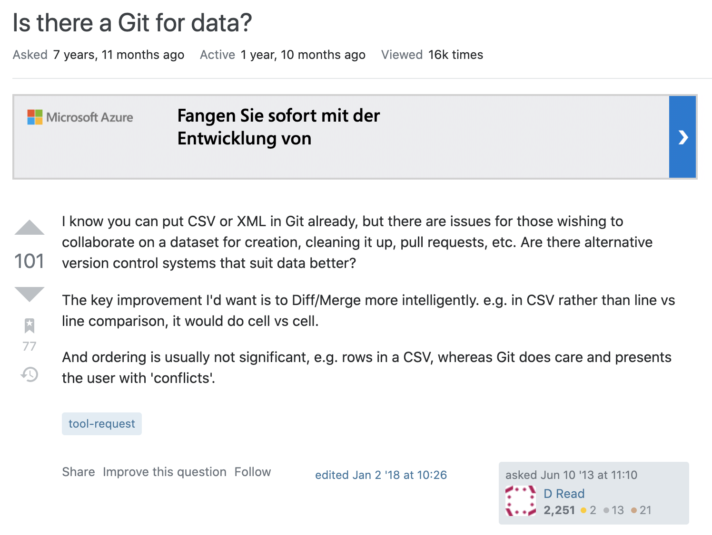

## What is data version control?

Real world data, such as logs, comments, and reviews, are usually messy and require substantial processing. Additionally, this data may be updated during the project, e.g., when data collection is ongoing (as is the case for many COVID-19 working papers). This can result in many different versions of datasets throughout the research project (e.g., v2, v3, featureXpresent, featureYabsent) and may lead to confusing and hardly reproducible results when looking at an analysis that has been conducted a few weeks back. Moreover, the data that researchers in social sciences and other fields have at hand become increasingly large, often exceeding several GBs. Simply running the entire pre-processing pipeline when compiling an R Markdown document can take hours to complete. Versioning intermediate datasets with Git is often not feasible due to storage restrictions of code repositories and technical difficulties to efficiently handle large files.

## Are researchers already using data version control?

I distributed a survey through the channels of the fellow program (n=15 completed answers) to understand current data research practices among other researchers from various disciplines. In particular, I asked them how they were versioning the different parts of their research projects, such as the manuscript, data analysis, but also the data itself. Interestingly, sophisticated data versioning practices (using GitHub or built-in functionalities of cloud storages) was prevalent for manuscript and data analysis versioning (> 50%). However, few researchers used Git for the data itself (n=3) and none of them were aware of specific tools for the versioning of larger data sets. Instead, several researchers voiced their interest in such tools and asked to be updated about this project in the future. In sum, the results indicate that data version control is neither a prevalent practice nor do researchers know about the advantages and disadvantages of specific tools. This shows a gap in the current research pipeline.

## Which tools exist?

These findings presented a great motivation for my project ecause they indicated a clear need in the research community (at least within the narrow sample of participants I surveyed). At the start of my research, I came across an old Stack Exchange post from 2013 with 16k views, which asked whether "Git for data" existed.

```{r git-for-data, echo=FALSE, fig.cap="'Is there a Git for data' on Stack Exchange (source: [https://opendata.stackexchange.com/questions/748/is-there-a-git-for-data](https://opendata.stackexchange.com/questions/748/is-there-a-git-for-data))",  fig.align="center", out.width="50%"}

```

Back then, Git for data wasn't something that really existed on the market. However, with the rise in data volume and, especially through the broad application of machine learning in many organizations, it became increasingly required to reproduce and share datasets. Thus, more recently, there have been a rise in open source tools that allow versions of datasets to be tracked over time. One comprehensive list of tools is available from: [https://docs.google.com/spreadsheets/d/1jGQY_wjj7dYVne6toyzmU7Ni0tfm-fUEmdh7Nw_ZH0k/edit?ts=5fc6a2a5#gid=0](https://docs.google.com/spreadsheets/d/1jGQY_wjj7dYVne6toyzmU7Ni0tfm-fUEmdh7Nw_ZH0k/edit?ts=5fc6a2a5#gid=0). Moreover, a discussion of these tools is available from: [https://www.youtube.com/watch?v=r5uxntl_hWg](https://www.youtube.com/watch?v=r5uxntl_hWg).

Git for data specifically allows for the versioning of different data sets and pipelines. As researchers have increasingly embraced git to version control manuscripts and scripts, version control of data is not on the radar of many researchers.

## Which tools should researchers use?

It depends on the use case. As outlined in the video shown above, there are different kinds of tools available, some offering more of a database-like tool where you can store data and see version control of that data, others offer you a more replicable research pipeline. Many (not all) are open source, which would definitely be an advantage.

Dolthub, for example, are advertising their space as a version controlled database which different people can make additions.

DVC is a pipeline tool that’s lightweight and storage agnostic.

